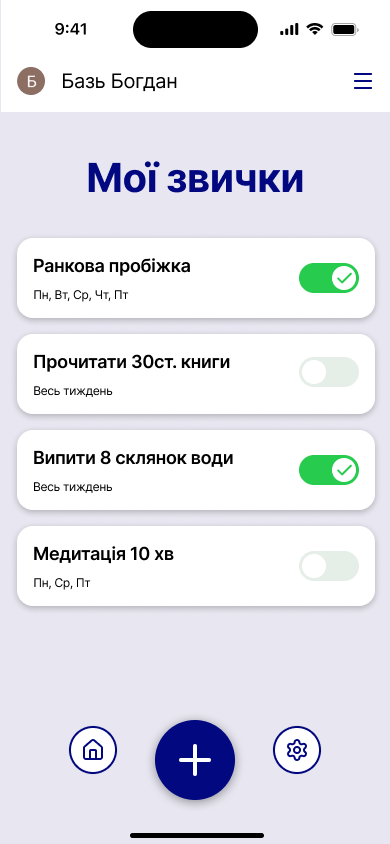

# sdlc-lab-Baz
# Лабораторна робота №3: Життєвий цикл ПЗ (Трекер звичок)

## 1. Планування

Мета продукту:
Створити простий мобільний або веб-застосунок, який дозволить користувачам **додавати власні щоденні звички** (наприклад, "спорт", "медитація", "читання") і **відмічати їх виконання** протягом дня, щоб візуально відстежувати свій прогрес та формувати нові корисні патерни.

## 2. Аналіз вимог (User Stories)

* Як користувач, я хочу **додавати нову звичку** (з назвою та іконкою), щоб розпочати її відстеження. **✅ (Must have)**
* Як користувач, я хочу **відмічати звичку як виконану** одним натисканням, щоб швидко фіксувати свій щоденний прогрес. **✅ (Must have)**
* Як користувач, я хочу **бачити список усіх моїх звичок** на одному екрані, щоб контролювати їх виконання сьогодні.
* Як користувач, я хочу **видаляти звичку** зі списку, коли вона стає неактуальною.
* Як користувач, я хочу **бачити статистику виконання** (наприклад, скільки днів поспіль я виконую звичку – "streak"), щоб мати додаткову мотивацію.

## 3. Дизайн (Прототип)

## 4. Реалізація (Псевдокод)

Для демонстрації реалізації обрана ключова функція: **markHabitAsCompleted** (Відмітка звички як виконаної/скасування відмітки).

function markHabitAsCompleted(habitID, currentDate):  
1. Отримати дані про виконання для обраної звички
    trackingRecord = database.getRecord(habitID);
2. Перевірити, чи звичка вже відмічена як виконана на поточну дату
    if trackingRecord.isCompletedForDate(currentDate):
3. Якщо вже виконана, то скасувати відмітку (тобто, toggle/переключити статус)
    trackingRecord.removeCompletion(currentDate);
    return "Відмітку виконання скасовано.";
else:
4. Якщо не виконана, то додати відмітку виконання
    trackingRecord.addCompletion(currentDate);
    return "Звичку успішно відмічено як виконану.";

5. Оновити запис у базі даних
  database.saveRecord(trackingRecord);

## 5. Тестування

Складено 3 тести для перевірки коректної роботи функції **markHabitAsCompleted**:

1.  **Сценарій 1: Успішне відмічання.**
    * *Вхід:* Звичка "Читання" **не відмічена** сьогодні.
    * *Дія:* Користувач натискає кнопку "Виконано".
    * *Очікуваний результат:* Звичка "Читання" отримує позначку **виконаної** на поточну дату, а функція повертає "Звичку успішно відмічено як виконану."

2.  **Сценарій 2: Скасування відмітки.**
    * *Вхід:* Звичка "Спорт" **вже відмічена** як виконана сьогодні.
    * *Дія:* Користувач повторно натискає кнопку "Виконано" (зміна статусу/toggle).
    * *Очікуваний результат:* Звичка "Спорт" **втрачає** позначку виконання, а функція повертає "Відмітку виконання скасовано."

3.  **Сценарій 3: Перевірка цілісності даних.**
    * *Вхід:* Звичка "Читання" була виконана **вчора**, але **не виконана сьогодні**.
    * *Дія:* Користувач відмічає "Читання" як виконану сьогодні.
    * *Очікуваний результат:* Відмітка виконання додається **лише для сьогоднішньої дати**, а **вчорашня відмітка залишається** незмінною.

## 6. Висновки

Для розробки такого мінімалістичного, орієнтованого на користувача застосунку, як Трекер звичок, найкраще підходить Agile-підхід
Це дозволить швидко випускати базову версію продукту  і гнучко додавати нові функції  на основі фідбеку користувачів. Використання моделі Waterfall було б занадто повільним і негнучким для проєкту, де вимоги можуть часто змінюватися.
